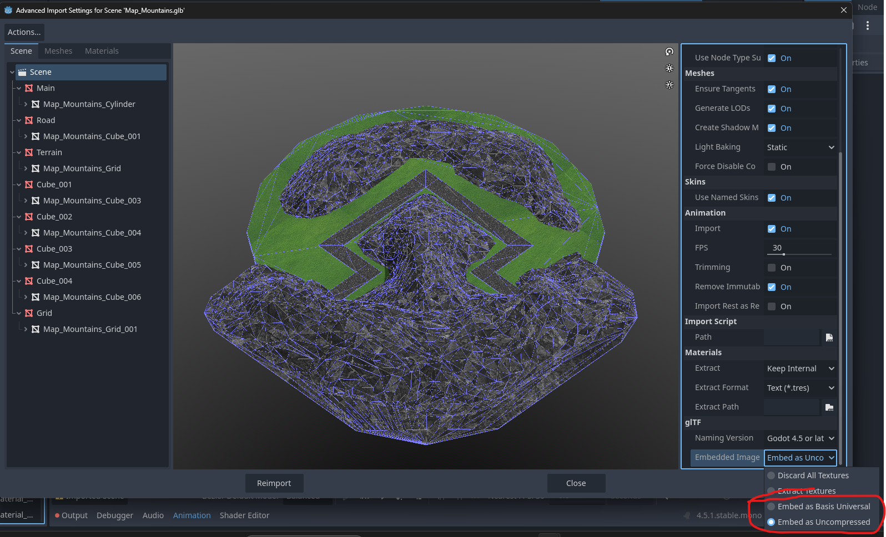

## Importing Models and Scenes

When creating content for mods, proper import settings and scene organization are crucial for compatibility and performance.

### GLB model import

For `.glb` format models, you need to embed resources directly into the file to ensure they work correctly in mods:

1. Select your `.glb` file in the Godot FileSystem dock
2. Open the import settings by double clicking on it
3. Select root and scroll down to "glTF" settings
4. In the "Embeded Image" select one of Embeded resource options (`Embeded as Basis Universal` or `Embeded as Uncompressed`)
5. Click **"Reimport"**

After importing your `.glb` model, you need to make all resources local to ensure they work properly in mods:

1. Create a new scene (`.scn` format recommended)
2. Drag your configured `.glb` file into the scene
3. In the Scene hierarchy, right-click on the imported model
4. Select **"Make Local"** from the context menu

### File formats problems

- **For scenes with embedded images/textures:** You must use `.tscn` format, according to the technical capabilities of the game
- **For all other scenes:** always create new scenes in `.scn` format (binary) rather than `.tscn` (text) when possible, as `.scn` files are significantly smaller and load faster.

## Working with Scenes in Mods

### Resource Paths

Resource paths in mods must match the relative structure of your Godot project. For example:
- If you add an image from `res://Sprites/test.png` to your scene
- In the mod, the file must be located at `Sprites/test.png` (relative to the mod folder)