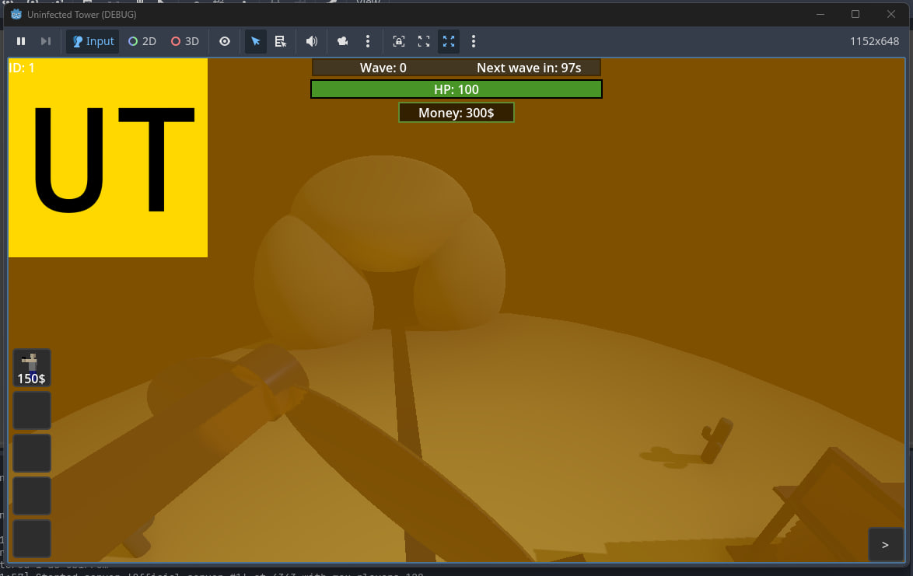

## Submodules

Submodules allow you to create mod features that work independently of any game mode. They run parallel to all game modes and can modify the game interface or behavior without interfering with core gameplay.

### How to Create a Submodule

Create lua file in `lua/autorun` (see <a href="#modstructure">mod structure</a>)

```lua
local myModule = {}

function myModule:_Ready()
    local image = game.CreateNode("TextureRect")
    image.Texture = LoadResource("UTIcon.png")
    self:GetParent():AddChild(image)
end

game.RegisterSubmodule("MyModule", myModule)
```

<br>

The example above creates a yellow "UT" logo in the top-left corner of the screen that appears in all game modes:

