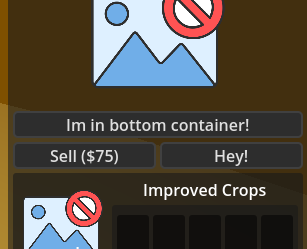

# Tower

To create new tower you need to fill [tower config](#towerconfig).  
In code you just need to create new class with same name, that in config you created. Let's look at example:

```lua
local Farm = {}

function Farm:OnTowerPlaced()
    print("I was placed!")
end

game.RegisterClass("MyNewFarm_Farm", Farm, "Tower")
```

Here you can see, that we just created new class by `game.RegisterClass`, and inherited from `Tower` class. It has base functions for work.

---

### `Tower.CanPlace(): boolean`

Checks is tower can be placed here (is overlapping areas of blocked placement).

#### Returns:

- `boolean` — Is tower can be placed.

---

### `Tower.SpawnRangeIndicator(name, range, color?)`

Spawns range indicator and adds it to internal dictionary to manipulate it.

#### Parameters:

- `name` (`string`) — Name of range indicator to identify it.
- `range` (`number`) — Range of indicator (radius).
- `color` (`Color`?) — **Optional**, just color of indicator.

---

### `Tower.RemoveRangeIndicator(string name)`

Spawns range indicator and adds it to internal dictionary to manipulate it.

#### Parameters:

- `name` (`string`) — Name of range indicator for deletion

---

### `Tower.ApplyUpgrade(pathIndex)`

Will call upgrade request on client to server, don't call it if `IsLocalForRoom(room)` is `false`.

#### Parameters:

- `pathIndex` (`number`) — Index of upgrade path.

---

### `Tower.LockPath(pathIndex): void`

Will block upgrade path to upgrade.

#### Parameters:

- `pathIndex` (`number`) — Index of upgrade path.

---

### `Tower.UnlockPath(pathIndex)`

Will unblock upgrade path to upgrade.

#### Parameters:

- `pathIndex` (`number`) — Index of upgrade path.

---

### `Tower.IsPathLocked(pathIndex): boolean`

Checks is path locked

#### Parameters:

- `pathIndex` (`number`) — Index of upgrade path.

#### Returns:

- `boolean` — Is path locked.

---

## Fields

| Field | Type | Access | Description |
|-------|------|--------|-------------|
| `TowerType` | `string` | get/set | Given id to indentify tower type and display it using stats wtirren in config. Used for synchronization, persistence, and lookup. Default: empty string. |
| `OwnerPeerID` | `int` | get | Peer ID of the player who owns the tower. `0` means no owner (e.g., before placement). |
| `OwnerName` | `string` | get | Display name of the tower's owner. Synchronized on placement or ownership change. |
| `CurrentRoom` | `Room` | get | The room this tower belongs to. Defines the network sync context. |
| `Team` | `Team` | get | The team this tower belongs to. Affects interactions with enemies and allies. |
| `Health` | `int` | get/set | Current health of the tower. When reaches `0`, the tower is destroyed. Default: `100`. |
| `MaxHealth` | `int` | get/set | Maximum health. If set to `0`, the tower becomes invincible. Default: `100`. |
| `IsSellable` | `bool` | get/set | Whether the tower can be sold. Default: `true`. Disabling this hides or disables the sell option in UI. |
| `SellPrice` | `int` | get/set | Sell price as a percentage of build cost. Changing this value automatically syncs it to all room players via `RpcRoomPlayers` and refreshes the upgrade menu UI if open. |
| `IsSelectedByUpgradeMenu` | `bool` | get | `true` if an upgrade menu is currently open for this tower (`CurrentOpenedUpgradeMenu != null`). |
| `CurrentOpenedUpgradeMenu` | `UpgradeMenuUI \| nil` | get | Reference to the currently active upgrade menu UI instance. Set internally by the UI system; not intended for external modification. |
| `UpgradePathsCount` | `int` | get | Number of upgrade paths initialized for this tower (typically defined in Lua config). |
| `EnableDefaultSellPriceCount` | `bool` | get/set | If `true`, `SellPrice` is auto-calculated based on upgrade progress (default behavior). If `false`, uses the explicitly set `SellPrice` value. Default: `true`. |

---

## Virtual functions

Here you can see functions, which calls on some events, like `OnTowerPlaced` in example in the start of this page.

| Function | Parameters | Description |
|----------|------------|-------------|
| `OnPreviewPlaced` | | calls when tower placed by `TowerPlacementManager` to preview future placement, it spawns only locally. |
| `OnTowerPlaced` | | calls when tower is initialized and added to scene tree. |
| `OnUpgradeMenuOpened` | `UpgradeMenuUI` | calls when tower is just selected by upgrade menu. |
| `OnUpgradeMenuClosed` | `UpgradeMenuUI` | calls when tower is stopped selecting by upgrade menu. |
| `PreProcessUpgrade` | `UpgradeMenuUI` | calls when client want to place tower, calls before sending request to server. In this function you can `return false` to prevent sending request. |
| `TowerUpgradePrecessed` | `UpgradeMenuUI` | calls when tower is upgraded by server successfully. |
| `PopulateUpgradeMenuButtons` | `UpgradeMenuUI`, `additionalButtonsContainer`, `bottomIconContainer` | calls when tower upgrade menu is opened, need to add buttons to containers. `additionalButtonsContainer` is `GridContainer` with 2 collumns when button >=2, and 1 column when 1 button. `bottomIconContainer` is `VBoxContainer`. |

---

## Example of PopulateUpgradeMenuButtons:

```lua
function MyTower:PopulateUpgradeMenuButtons(upgradeMenu, additionalButtonsContainer, bottomIconContainer)
    local helloButton = game.CreateNode("Button")
    helloButton.Text = "Hey!"

    local bottomIconContainerButton = game.CreateNode("Button")
    bottomIconContainerButton.Text = "Im in botton container!"

    additionalButtonsContainer.AddChild(helloButton)
    bottomIconContainer.AddChild(bottomIconContainerButton)
end
```

You will see something like this:

