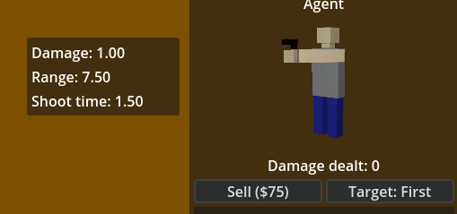

## Towers Config

```json
{
    "StandardPack_Agent": {
        "PrintName": "Agent",
        "Icon": "Sprites/Towers/Agent.dds",
        "Scene": "Towers/StandardPack_Agent.scn",
        "PlacementCost": 150,
        "BaseStats": {
            "Damage": 1,
            "Range": 7.5,
            "ShootTime": 1
        },
        "RegisteredStats": [
            {
                "LuaElement": "Damage",
                "ReadableName": "Damage",
                "Icon": "" 
            },
            {
                "LuaElement": "Range",
                "ReadableName": "Range",
                "Icon": "" 
            },
            {
                "LuaElement": "ShootTime",
                "ReadableName": "Shoot time",
                "Icon": "" 
            }
        ],
        "LockPathLevel": 2,
        "UpgradePaths": [
            {
                "Levels": [
                    {
                        "Name": "Enhanced Weapon",
                        "Description": "+1 damage",
                        "Cost": 75,
                        "Icon": "Sprites/Towers/Agent.dds",
                        "StatChanges": {
                            "Damage": 1
                        }
                    },
                    {
                        "Name": "Rapid Fire",
                        "Description": "+2 damage\n+10% fire rate",
                        "Cost": 150,
                        "Icon": "Sprites/Towers/Agent.dds",
                        "StatChanges": {
                            "Damage": 2,
                            "ShootTime": -0.1
                        }
                    }
                ]
            },
            {
                "Levels": [
                    {
                        "Name": "Extended Range",
                        "Description": "+2 range",
                        "Icon": "Sprites/Towers/Agent.dds",
                        "Cost": 100,
                        "StatChanges": {
                            "Range": 2
                        }
                    }
                ]
            }
        ]
    }
}
```

### Fields explained

- **PrintName** - The readable name shown to players in the game
- **Icon** - Path to the tower's icon image
- **Scene** - Path to the Godot scene file that will be spawned during initialization
- **PlacementCost** - The cost to place this tower initially
- **BaseStats** - The tower's base statistics that are set in the Lua table
- **RegisteredStats** - Defines which stats are visible to players in the UI:
  - **LuaElement** - The internal name of the stat in Lua
  - **ReadableName** - The display name shown to players
  - **Icon** - Path to icon for this stat (can be empty)
- **LockPathLevel** - The upgrade level at which the path lock mechanic starts working
- **UpgradePaths** - Array of upgrade paths, each containing:
  - **Levels** - Array of upgrade levels for this path:
    - **Name** - Name of the upgrade
    - **Description** - Description shown to players
    - **Cost** - Cost to purchase this upgrade
    - **Icon** - Path to upgrade icon
    - **StatChanges** - Statistics that change with this upgrade

---

Example how registered stats looks in-game:



---

Add your towers file to [main config](#mainconfig):

```json
{
    "TowersConfig": "Towers.json"
}
```