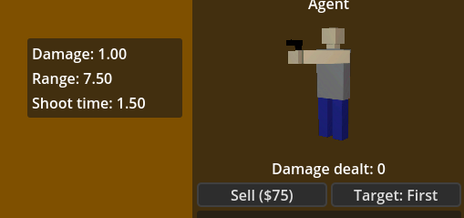

## Towers Config

```json
{
    "StandardPack_Agent": {
        "PrintName": "Agent",
        "Description": "A basic agent tower that shoots at enemies.",
        "Icon": "Sprites/Towers/Agent.dds",
        "Scene": "Towers/StandardPack_Agent.scn",
        "PlacementCost": 150,
        "BaseStats": {
            "Damage": 1,
            "Range": 7.5,
            "ShootTime": 1
        },
        "Shop": [
            {
                "Type": "Currency",
                "Name": "Money",
                "Value": "200"
            },
            {
                "Type": "Condition",
                "Name": "Desc",
                "Value": "Id_of_condition"
            }
        ],
        "RegisteredStats": [
            {
                "LuaElement": "Damage",
                "ReadableName": "Damage",
                "Icon": ""
            },
            {
                "LuaElement": "Range",
                "ReadableName": "Range",
                "Icon": "",
                "HideField": "<=0",
                "DecimalPlaces": 3
            },
            {
                "LuaElement": "ShootTime",
                "ReadableName": "Shoot time",
                "Icon": "",
                "LowerBetter": true
            }
        ],
        "LockPathLevel": 2,
        "UpgradePaths": [
            {
                "Levels": [
                    {
                        "Name": "Enhanced Weapon",
                        "Description": "+1 damage",
                        "Cost": 75,
                        "Icon": "Sprites/Towers/Agent.dds",
                        "StatChanges": {
                            "Damage": 1
                        }
                    },
                    {
                        "Name": "Rapid Fire",
                        "Description": "+2 damage\n+10% fire rate",
                        "Cost": 150,
                        "Icon": "Sprites/Towers/Agent.dds",
                        "StatChanges": {
                            "Damage": 2,
                            "ShootTime": -0.1
                        }
                    }
                ]
            },
            {
                "Levels": [
                    {
                        "Name": "Extended Range",
                        "Description": "+2 range",
                        "Icon": "Sprites/Towers/Agent.dds",
                        "Cost": 100,
                        "StatChanges": {
                            "Range": 2
                        }
                    }
                ]
            }
        ]
    }
}
```

### Fields explained

- **PrintName** - The readable name shown to players in the game
- **Description** - A text description of the tower shown to players in the shop/selection UI
- **Icon** - Path to the tower's icon image
- **Scene** - Path to the Godot scene file that will be spawned during initialization
- **PlacementCost** - The cost to place this tower initially
- **Shop** - Array of shop requirements that must be met for the tower to be available for purchase. If the field is empty or omitted, the tower is **free** (no requirements). Each entry contains:
  - **Type** - The type of requirement. Supported values:
    - `"Currency"` - Requires a specific currency to be registered. Currencies are created via `Shop.RegisterCurrency("Money", "Money", "", 300)`.
    - `"Condition"` - Requires a game condition to be met. Conditions are created via `game.CreateCondition("Name", function() end)`.
  - **Name** - Display name or identifier for the requirement
  - **Value** - The value associated with the requirement (e.g. currency amount as a string, or condition ID)
- **BaseStats** - The tower's base statistics that are set in the Lua table
- **RegisteredStats** - Defines which stats are visible to players in the [UpgradeMenuUI](pages/upgrademenuui.md):
  - **LuaElement** - The internal name of the stat in Lua
  - **ReadableName** - The display name shown to players
  - **Icon** (optional) - Path to icon for this stat
  - **LowerBetter** (optional) - Marker for the upgrade menu (and other mods) to indicate that a *decrease* in this stat's value is considered an improvement (e.g., Cooldown, Reload Time), ensuring the UI displays it as a positive change.
  - **HideField** (optional) - Condition to hide the stat row in the upgrade menu. Only works for numeric stats. Format: operator + value, e.g. `"<=0"`, `"==1"`, `"!=0"`, `">=5"`, `"<10"`, `">3"`. Supported operators: `<=`, `>=`, `==`, `!=`, `<`, `>`. If the condition is true, the stat is hidden.
  - **DecimalPlaces** (optional) - Number of decimal places shown for numeric stats. Default: `2` (auto-formatted: integers show without decimals, one-decimal values show one place). Set any integer to force fixed precision, e.g. `"DecimalPlaces": 3` shows `7.500`.
- **LockPathLevel** - The upgrade level at which the path lock mechanic starts working
- **UpgradePaths** - Array of upgrade paths, each containing:
  - **Levels** - Array of upgrade levels for this path:
    - **Name** - Name of the upgrade
    - **Description** - Description shown to players
    - **Cost** - Cost to purchase this upgrade
    - **Icon** - Path to upgrade icon
    - **StatChanges** - Statistics that change with this upgrade (**WARNING:** if its number, so it pluses given value)

---

Example how registered stats looks in-game:



---

Add your towers config to any subfoler of `Configs/Towers`